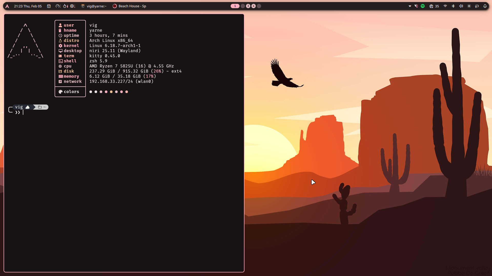

# 📂 ~/dots

> **My personal Niri + Noctalia configuration (formerly Hyprland/ML4W).**
> Managed with GNU Stow.



## 📖 The Story

For 3 years, I daily drove **[Hyprland](https://hyprland.org/)** using the excellent **[ML4W (My Linux 4 Work)](https://github.com/mylinuxforwork/dotfiles)** dotfiles. It served me well, I was inexperienced at the time and had a really unstable and fragmanted system, I wanted something fresh and more stable.

I have migrated to **[Niri](https://github.com/YaLTeR/niri)**, a scrollable-tiling Wayland compositor that offers a unique infinite-scrolling workflow. For the shell (bars, widgets, and UI), I am using a custom fork (mainly to make it more AZERTY friendly) of **[Noctalia Shell](https://github.com/noctalia-dev/noctalia-shell)**, which is built on the lightning-fast **Quickshell** engine.

This repository contains my current configuration, cleaned up and modularized using **GNU Stow** to keep my home directory pristine.

---

## 🛠️ The Stack

| Component      | Tool                                                                     |
| :------------- | :----------------------------------------------------------------------- |
| **Compositor** | [Niri](https://github.com/YaLTeR/niri)                                   |
| **Shell / UI** | [Noctalia](https://github.com/noctalia-dev/noctalia-shell) (Custom Fork) |
| **Terminal**   | [Kitty](https://sw.kovidgoyal.net/kitty/)                                |
| **Editor**     | [Neovim](https://neovim.io/)                                             |
| **Shell**      | Zsh + [Oh My Posh](https://ohmyposh.dev/)                                |
| **Fetch**      | [Fastfetch](https://github.com/fastfetch-cli/fastfetch)                  |
| **Manage**     | [GNU Stow](https://www.gnu.org/software/stow/)                           |

---

## ⚡ Installation

### 1. Requirements

Ensure you have the following installed on your system (Arch/Pacman example):

```bash
sudo pacman -S niri stow kitty neovim zsh fastfetch git
# You will also need Quickshell installed for Noctalia
```

### 2. Backup Your Current Configs

**⚠️ Warning:** Stow will overwrite existing configs if you force it, but it's safer to move them out of the way first.

```bash
mkdir -p ~/backups/pre-stow
mv ~/.config/niri ~/backups/pre-stow/
mv ~/.config/kitty ~/backups/pre-stow/
mv ~/.zshrc ~/backups/pre-stow/
# ... repeat for any other apps you are stowing

```

### 3. Clone & Stow

Clone this repository to your home folder:

```bash
git clone https://github.com/Vigintillionn/dotfiles.git ~/dots
cd ~/dots

```

Apply the configurations using Stow. You can pick and choose which modules you want:

```bash
# Install everything
stow .
```

---

## 📝 Credits & Inspiration

- **[Noctalia Shell](https://github.com/noctalia-dev/noctalia-shell)**: For the beautiful foundation of my desktop UI.
- **[ML4W](https://github.com/mylinuxforwork/dotfiles)**: For the Hyprland scripts and configs I used for years.
- **[Niri](https://github.com/YaLTeR/niri)**: For the infinite scrolling experience.
